# Epidemic Simulation Model

This project implements and parallelizes a simplified epidemic simulation model to observe the spread of a contagious disease within a community. The model tracks how the infection propagates over time as individuals move within a defined area, allowing insights into spatial and temporal patterns of disease spread.

## Problem Description

Large-scale epidemic simulations are essential for public health planning and forecasting. However, realistic models require immense computing power, often utilizing parallel, cloud-based distributed solutions. In this project, we implement a simplified version of such a model.

### Model Overview

- **Community Layout**: 
  - Individuals inhabit a rectangular area, with each person’s location defined by discrete coordinates (x, y).
  - Coordinates represent small areas where contagion can occur if two individuals are at the same location simultaneously.

- **Movement and Contagion**:
  - Each individual moves in a fixed direction (North, South, East, or West) and changes direction when reaching the area’s boundaries.
  - Movement follows a fixed amplitude, but individuals can only infect others when they share the exact coordinates at the same time.

- **Health States**:
  - Individuals can be:
    - **Infected**: Currently contagious.
    - **Immune**: Recently recovered, temporarily resistant to reinfection.
    - **Susceptible**: Not immune or infected, can catch the disease if exposed.
  - Infection and immunity periods are defined by constants:
    - `INFECTION_DURATION`: Duration for which an individual remains contagious.
    - `IMMUNE_DURATION`: Duration for which an individual is immune post-recovery.

### Simulation Process

1. **Initialize Simulation**:
   - Set the starting location and health status for each individual.

2. **Each Time Step**:
   - Update each individual’s location based on their movement direction and amplitude.
   - Calculate each individual’s future health status based on proximity to infected individuals and time-based recovery/immunity changes.
   - Increment the simulation time and update all individuals’ future statuses to their current status.

3. **Simulation Termination**:
   - The simulation runs for a specified duration, tracking infection spread across the community over time.

## Requirements

The simulation requires certain initial parameters and data to be provided through command line arguments and input files:

### Command Line Arguments
- `TOTAL_SIMULATION_TIME`: The total time for which the simulation will run.
- `InputFileName`: Name of the input file containing initial data.
- `ThreadNumber`: Number of threads to use for parallelization.

### Input File Structure
The input file must contain the following information:

1. **Simulation Area Size**:
   - `MAX_X_COORD` and `MAX_Y_COORD`: Define the boundaries of the rectangular simulation area.

2. **Community Data**:
   - `N`: Number of individuals in the area. For each individual, the following data should be specified on a new line:
     - `PersonID`: Unique identifier for the person.
     - Initial coordinates `x`, `y`: Must be within `0..MAX_X_COORD` and `0..MAX_Y_COORD`.
     - Initial status:
       - `infected=0` for initially infected persons (who are infected at time zero).
       - `susceptible=1` for persons who are not yet immune or infected.
     - Movement pattern:
       - `Direction`: One of `N=0`, `S=1`, `E=2`, `W=3` (North, South, East, or West).
       - `Amplitude`: Integer defining the movement distance per step, smaller than the area’s dimension in the movement direction.

## Algorithms Implementation

### Sequential and Parallel Simulation

The simulation includes both a sequential and parallel implementation. The parallel version uses **pthreads** and distributes individuals across the specified number of threads.

- **Synchronization**: To ensure accuracy, synchronization points are enforced between threads:
  - All individuals’ locations must be updated before computing infection statuses.
  - All individuals’ infection statuses must be updated before moving to the next time step.

### Expected Results

The final output for each individual will include:
- **Final coordinates**: (x, y)
- **Final status**: (infected, immune, or susceptible)
- **Infection counter**: The number of times the individual was infected during the simulation.

Output files follow the naming convention `f_serial_out.txt` and `f_parallel_out.txt` based on the input file name (`f.txt`). Only final results are saved; intermediate statuses at each simulation step are not saved.

### Verification and Modes

- **Result Verification**: An automatic method compares the sequential and parallel outputs to ensure both versions yield the same results.
- **Running Modes**: 
  - **DEBUG mode**: Prints the evolution of individuals at each generation for inspection.
  - **Normal mode**: Suppresses print statements, optimized for performance measurement.

### Performance Measurement

- **Runtime Measurement**: Serial and parallel runtimes are measured, excluding file I/O operations, to calculate the speedup achieved by parallelization.
- **Parameter Variations**:
  - Population sizes: 20K, 1M, 2M, 10M individuals.
  - Simulation durations: 100, 1000, 2000, 5000 time units.
  - Thread counts for parallel execution.

## Results
The hardware used for this experiment is following:
* HP ProDesk 600 G3 DM
* Intel® Core™ i5-6500T × 4 Cores
* 16.0 GiB RAM

### Execution Time
After computing the input data for 20K, 1M, 2M, 10M individuals across 100, 1000, 2000, 5000 time units following results can be seen:

- **20,000 People**

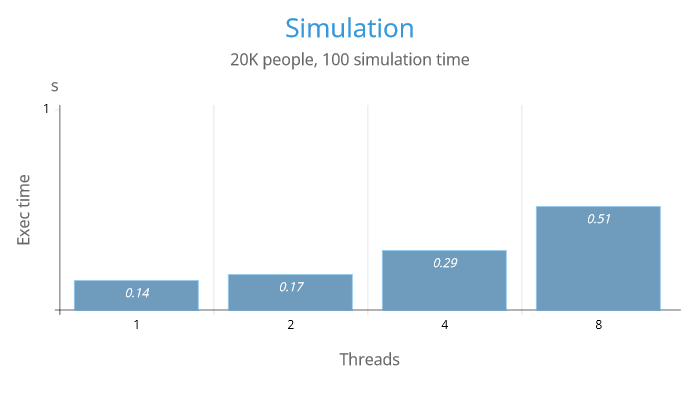
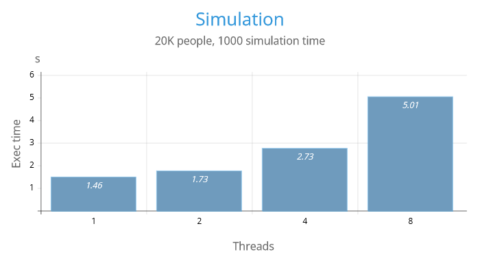
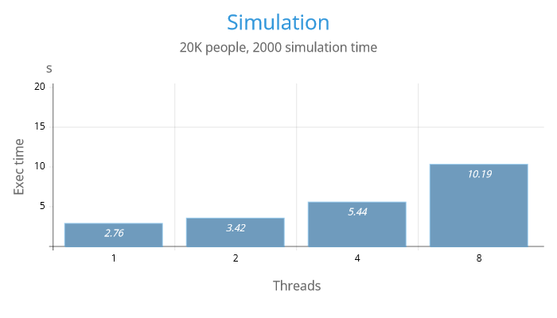
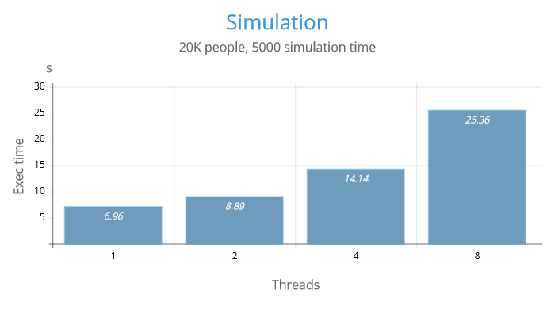

- **1 Million People**

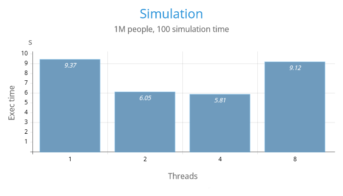

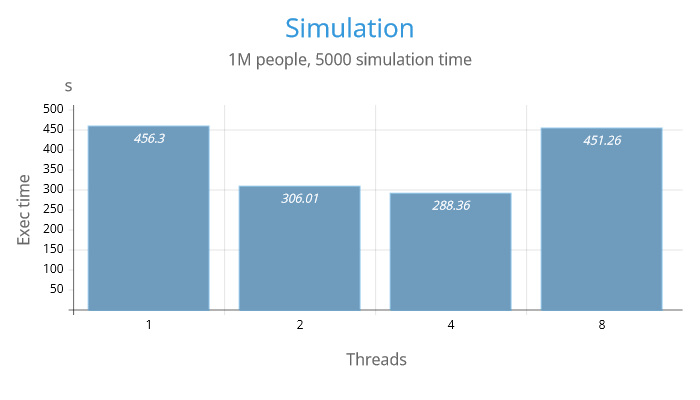

- **2 Million People**

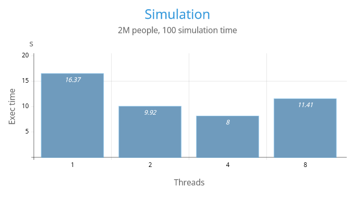
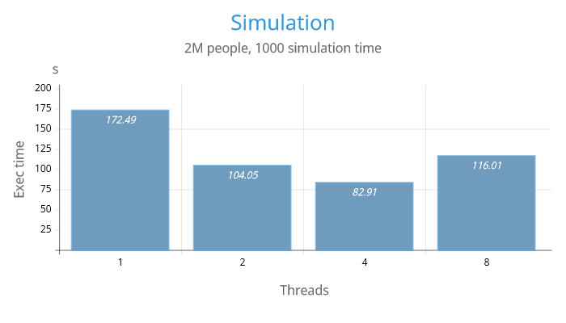
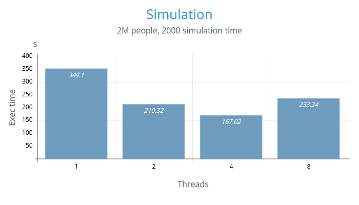
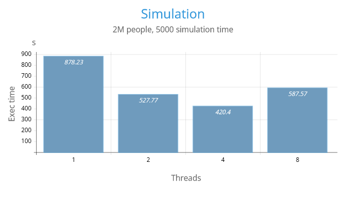

- **10 Million People**

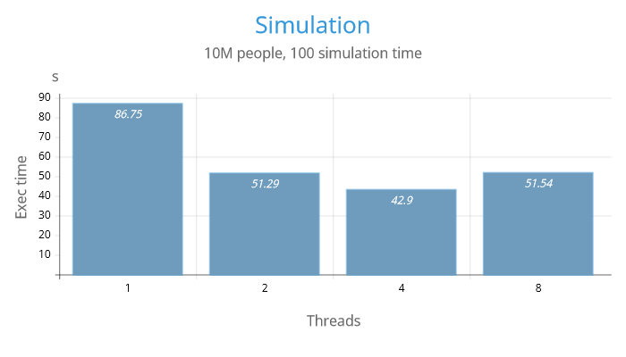
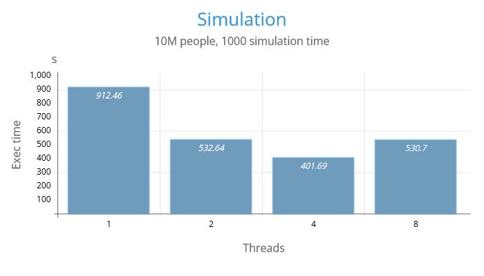
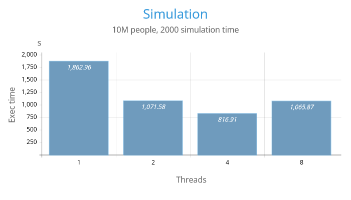
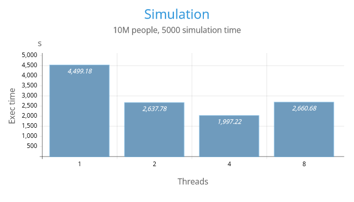

### Speedup
- An average speedup can be considered:
    - **1.52** for 2 threads (max **1.70** for 10M data set, min **0.78** for 20K)
    - **1.68** for 4 threads (max **2.25** for 10M data set, min **0.49** for 20K)
    - **1.02** for 8 threads (max **1.67** for 10M data set, min **0.27!** for 20K)

### Observations

Given the hardware configuration - a processor with 4 cores, we can conclude that optimal performance is achieved with 4 threads for this task set. Utilizing more threads than available cores can lead to an uneven distribution of tasks, resulting in diminished or even negative performance gains due to the overhead of managing excess threads. 

Consequently, using thread counts that exceed the core count can lead to suboptimal speedups, as shown in the data.
